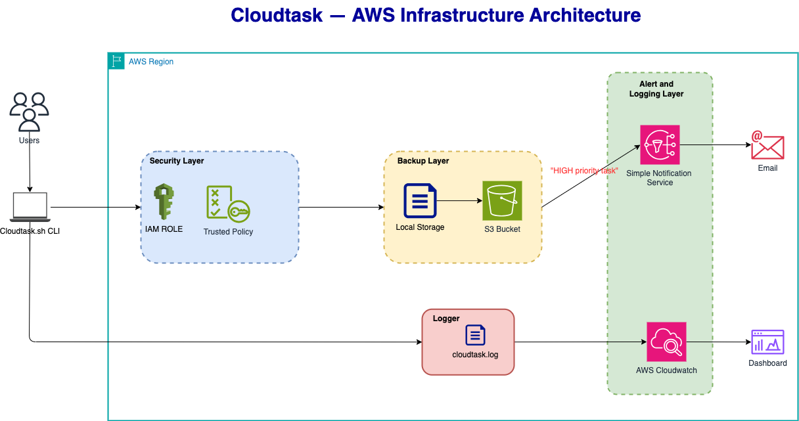

# ☁ CloudTask Pro

**AWS-Integrated Terminal Task Manager — Built for Production**

> *Build it like you're handing it to a colleague.*


`Cloudtask` is a production-grade command-line task manager for DevOps and Cloud engineers. It persists tasks to a local CSV, automatically backs it up to S3 after every write, fires SNS alerts for HIGH priority tasks, and ships every action to CloudWatch — all without leaving the terminal.



**Key Features and Capabilities:**

- **Core Functionality:** Add, list, complete, and delete tasks with priority levels (LOW / MEDIUM / HIGH) from your terminal, persisted to a local CSV file.

- **AWS Integration:** Automatically backs up to S3, fires SNS alerts for HIGH priority tasks, and ships every action to CloudWatch — all on every write.
- **Log Collection:** Every CLI action emits a structured log entry to CloudWatch Logs, queryable via Logs Insights for auditing and debugging.
- **DevOps-Friendly Design:** Zero GUI, pipeline-friendly with exit codes and JSON output, built for terminal-first DevOps workflows.

- **Compatibility:** Runs on Linux, macOS, and Windows (WSL) with support for AWS CLI profiles, env vars, and IAM instance profiles across any region.
- **Security:** Credentials never leave the AWS credential chain — IAM least-privilege policies, no hardcoded secrets, S3 encryption supported.
- **Reliability & Observability:** Local CSV fallback when AWS is unreachable, S3 versioning for full task history, and CloudWatch Alarms for backup failures and error spikes.
- **Open Source:** The code is available on [GitHub](https://github.com/intellisenseCodez/CloudTask) under the MIT license


## Table of Contents

1. [Prerequisites](#1-prerequisites)
2. [Environment Variables](#2-environment-variables)
3. [AWS Resources Configuration](#3-aws-resources-configuration-optional-setup)
4. [Usage](#4-usage)
5. [Data & File Reference](#5-data--file-reference)
6. [Task Lifecycle](#6-task-lifecycle)
7. [Concurrency & Safety](#7-concurrency--safety)
8. [Troubleshooting](#8-troubleshooting)
9. [Post-Submission Cleanup](#9-post-submission-cleanup)


## 1. Prerequisites

### Tools

| Requirement | Minimum Version | Check Command |
|---|---|---|
| Ubuntu VM / WSL2 / EC2 | 22.04 LTS | `lsb_release -a` |
| Bash | 4.0 + | `bash --version` |
| AWS CLI | v2.x | `aws --version` |
| AWS Account | Active + Free Tier | `aws sts get-caller-identity` |
| unzip / curl / openssl | any recent | `curl --version && unzip --version && openssl --version ` |


### IAM Permissions

Your IAM user must have the following minimum permissions. The IAM roles are pre-configured for this project — refer to your `~/.aws/credentials` or instance metadata if you are unsure which identity is active.

| Service | Actions Required | Why |
|---|---|---|
| S3 | `s3:PutObject`, `s3:GetObject`, `s3:ListBucket`, `s3:CreateBucket`, `s3:PutBucketVersioning`, `s3:PutBucketPublicAccessBlock` | Upload backup, verify upload, list bucket, create bucket, set versioning, block public access |
| SNS | `sns.CreateTopic`, `sns:Subscribe`, `sns:Publish`, `sns:ListSubscriptionsByTopic`  | Create topic, subscribe email, fire HIGH priority alert, list topics |
| CloudWatch Logs | `logs:CreateLogGroup`, `logs:CreateLogStream`, `logs:PutLogEvents`, `logs:DescribeLogGroups`, `logs:PutRetentionPolicy`, `logs:DescribeLogStreams`, `logs:GetQueryResults` | Create resources if missing; ship log entries |

For instructions on installing and configuring the AWS CLI, please refer to this guide: [link](https://dev.to/abstractmusa/install-aws-cli-command-line-interface-on-ubuntu-1b50)

```bash
# Verify your current identity
aws sts get-caller-identity
```

### Clone & Install
```bash
# 1. Clone the repository
git clone https://github.com/helix-digital/cloudtask.git
cd cloudtask

# 2. Make the script executable
chmod +x cloudtask.sh
```

## 2. Environment Variables

All variables use safe defaults via Bash parameter expansion (`${VAR:-default}`) so the script never crashes on a missing value. Setting them explicitly is still strongly recommended.

| Variable | Required | Default | Description |
|---|---|---|---|
| `AWS_REGION` | Yes | `us-east-1` | AWS region for all service calls |
| `S3_BUCKET` | Yes | *(none)* | Bucket name for task backups |
| `SNS_TOPIC_ARN` | Yes | *(none)* | Full ARN of the cloudtask-alerts topic |
| `CW_LOG_GROUP` | Yes | `/cloudtask/prod` | CloudWatch log group name |
| `CLOUDTASK_DIR` | No | `~/.cloudtask` | Local data directory override |

```bash
# Recommended: Set required environment variables (add to ~/.bashrc for persistence)
export AWS_REGION="your-aws-region"
export S3_BUCKET="your-s3-bucket"
export SNS_TOPIC_NAME="your-sns-topic-name"
export SNS_TOPIC_ARN="your-sns-topic-arn"
export CW_LOG_GROUP="your-cloudwatch-log-group"

export CLOUDTASK_DIR="~/.cloudtask"
```

> **Tip:** Add the `export` lines to `~/.bashrc` or `~/.bash_profile` so environment variables survive terminal restarts. Run `source ~/.bashrc` to reload without logging out.


## 3. AWS Resources Configuration (Optional Setup)

All three AWS resources must exist before the script can perform cloud operations. The script degrades gracefully if they are missing — **tasks are still saved locally** — but AWS integrations will not fire. Provision in the order shown below.

### 2.1 Create S3 Bucket Via CLI

The bucket stores a timestamped snapshot of `tasks.csv` after every write operation.

```bash
# Create the bucket to your preferred region
aws s3api create-bucket \
    --bucket "${S3_BUCKET}" \
    --region "${AWS_REGION}" \
    --create-bucket-configuration LocationConstraint="${AWS_REGION}"

# Enable versioning for extra safety
aws s3api put-bucket-versioning \
  --bucket ${S3_BUCKET} \
  --versioning-configuration Status=Enabled

# Block all public access
aws s3api put-public-access-block \
  --bucket ${S3_BUCKET} \
  --public-access-block-configuration \
    "BlockPublicAcls=true,IgnorePublicAcls=true,BlockPublicPolicy=true,RestrictPublicBuckets=true"

# Verify
aws s3 ls s3://${S3_BUCKET}
```

### 2.2 Create SNS Topic Via CLI

An SNS alert fires whenever a task is created with `Priority=HIGH`. Subscribe at least one endpoint so alerts reach your on-call channel.

```bash
# Create the topic
aws sns create-topic \
  --name ${SNS_TOPIC_NAME} \
  --region ${AWS_REGION}

# Capture the ARN returned above and export it
export SNS_TOPIC_ARN="arn:aws:sns:${AWS_REGION}:ACCOUNT_ID:your-sns-topic-name"

# Subscribe your email address
aws sns subscribe \
  --topic-arn ${SNS_TOPIC_ARN} \
  --protocol "email" \
  --notification-endpoint "your-email@domain.com"

# Verify
aws sns list-subscriptions-by-topic --topic-arn ${SNS_TOPIC_ARN}
```

### 2.3 CloudWatch Log Group (Audit Trail)

Every action — including reads — is shipped to CloudWatch. The compliance team uses this log for auditing.

```bash
# Create the log group
aws logs create-log-group \
  --log-group-name ${CW_LOG_GROUP} \
  --region ${AWS_REGION}

# Set a 90-day retention policy
aws logs put-retention-policy \
  --log-group-name ${CW_LOG_GROUP} \
  --retention-in-days 90

# Verify the group exists
aws logs describe-log-groups --log-group-name-prefix "/cloudtask"
```

## 4. Usage

### 4.1 Interactive Menu

**Run the script**
```bash
./cloudtask.sh
```

Launches the numbered main menu. Navigate by entering the option number. Invalid input redisplays the menu without exiting.

| Option | Action |
|---|---|
| `1` | Add a new task |
| `2` | List all tasks (paginated, colour-coded) |
| `3` | Update an existing task |
| `4` | Mark a task as complete |
| `5` | Delete a task (requires typing `DELETE`) |
| `6` | Search tasks by keyword |
| `7` | Filter tasks (category / priority / status / overdue) |
| `8` | View statistics dashboard |
| `9` | Export tasks to CSV |
| `10` | View local audit log |
| `0` | Exit |

### 4.2 CLI Flags

Use CLI flags to call the script from other scripts, cron jobs, or CI pipelines without the interactive menu.

| Command | Behaviour |
|---|---|
| `./cloudtask.sh` | Launch interactive menu (default) |
| `./cloudtask.sh --help` | Print usage guide, env vars, and data paths — then exit |
| `./cloudtask.sh add` | Jump directly to Add Task prompt — then exit |
| `./cloudtask.sh list` | Print all tasks as a formatted table — no menu, then exit |

### 4.3 Adding a Task — Field Reference

Every field is validated before the record is written.

| Field | Type | Valid Values / Format | Notes |
|---|---|---|---|
| Name | String | Any text; no commas — use semicolons | Required; commas break the CSV parser |
| Description | String | Any text; no commas — use semicolons | Required; commas break the CSV parser |
| Category | Enum | `ops` / `dev` / `security` / `infra` / `other` | Case-insensitive |
| Priority | Enum | `LOW` / `MEDIUM` / `HIGH` | `HIGH` fires an SNS alert immediately |
| Due Date | Date | `YYYY-MM-DD` (e.g. `2025-03-15`) | Must be a real calendar date |

---

## 5. Data & File Reference

### 5.1 Directory Layout

```
cloudtask/
├── docs                  ← document files
├── .gitignore
├── cloudtask.sh          ← main script 
├── Dockerfile            ← dockerfile
├── README.md             ← this file
└── ~/.cloudtask/         ← auto-created on first run
    ├── tasks.csv         ← task database (single source of truth)
    ├── cloudtask.log     ← append-only structured audit log
    ├── backups/          ← local timestamped snapshots
    └── cloudtask.lock    ← PID-based concurrency guard
```

### 5.2 tasks.csv Schema

The script enforces this schema on every read and write. The header row is always present. **Never edit the file by hand while the script is running.**

| Field | Type | Set By | Notes |
|---|---|---|---|
| `ID` | String (3-digit) | Auto on add | Zero-padded (`001`, `002`, …); never reused |
| `Name` | String | User on add | Semicolons only — no commas |
| `Description` | String | User on add | Semicolons only — no commas |
| `Category` | Enum | User on add | `ops` / `dev` / `security` / `infra` / `other` |
| `Priority` | Enum | User on add / update | `LOW` / `MEDIUM` / `HIGH` |
| `Status` | Enum | System | `PENDING` on create; `COMPLETED` on mark-complete |
| `DueDate` | `YYYY-MM-DD` | User on add / update | `OVERDUE` is derived at display time — never stored |
| `CreatedAt` | ISO 8601 | Auto on add | Set once; never updated |
| `UpdatedAt` | ISO 8601 | Auto on all writes | Stamped on every modification |
| `CompletedAt` | ISO 8601 or blank | Auto on complete | Blank until task transitions to `COMPLETED` |

```
# Header row (always present)
ID,Name,Description,Category,Priority,Status,DueDate,CreatedAt,UpdatedAt,CompletedAt

# Example record
001,Deployment,Deploy staging environment,ops,HIGH,PENDING,2025-03-15,2025-03-01T09:00:00,2025-03-01T09:00:00,
```

### 5.3 cloudtask.log Format

Every line in the log follows this structure. The log is append-only and survives script restarts.

```log
[2025-03-01T09:15:42] [INFO]  [add_task]    Task 001 created — Deploy staging environment (HIGH)
[2025-03-01T09:16:05] [INFO]  [s3_backup]   Backup uploaded → s3://helix-cloudtask-backup/backups/tasks_20250301_091605.csv
[2025-03-01T09:16:05] [INFO]  [sns_alert]   HIGH priority alert published for Task 001
[2025-03-01T09:16:06] [INFO]  [cw_log]      Log entry shipped to /cloudtask/prod
[2025-03-01T09:20:11] [WARN]  [s3_backup]   S3 backup failed — check credentials and bucket name
```


## 6. Task Lifecycle

```
         add_task()
            │
            ▼
        ┌─────────┐
        │ PENDING │ ◄─────────────────────────────┐
        └────┬────┘                               │
             │                                    │
    DueDate < today?                              │
             │                                    │
             ▼                                    │
        ┌─────────┐   mark_complete()   ┌─────────────┐
        │ OVERDUE │ ──────────────────► │  COMPLETED  │
        └────┬────┘                     └─────────────┘
             │                                    ▲
             │         mark_complete()            │
             └────────────────────────────────────┘
```

| State | Description |
|---|---|
| `PENDING` | Default state on creation. Task is outstanding. |
| `OVERDUE` | Derived display state only — not stored in CSV. Shown when `Status=PENDING` and `DueDate < today`. |
| `COMPLETED` | Set by Mark Complete (option 4). `CompletedAt` is stamped at this moment. |
| *(deleted)* | Record removed from `tasks.csv` after explicit `DELETE` confirmation. A local snapshot is taken first. |

**State rules:**
- A task is always born in `PENDING` — it cannot be created directly as `COMPLETED`
- `OVERDUE` is never written to `tasks.csv`; it is calculated at render time
- An overdue task can still be marked `COMPLETE` — the transition is always available
- Both `PENDING` and `COMPLETED` tasks can be deleted


## 7. Concurrency & Safety

The script uses a PID lock file (`~/.cloudtask/cloudtask.lock`) to prevent two instances from writing simultaneously. On startup, if the lock file exists and the PID inside it corresponds to a running process, the script exits with an error. The lock is always released via `trap release_lock EXIT`.

**Stale lock recovery:**

If the machine rebooted while the script was running, a stale lock file may be left behind. Remove it manually and rerun:

```bash
rm ~/.cloudtask/cloudtask.lock
./cloudtask.sh
```

Only do this if you are certain no other instance of `cloudtask.sh` is running.

---

## 8. Troubleshooting

| Symptom | Resolution |
|---|---|
| `Another instance is running` on startup | `rm ~/.cloudtask/cloudtask.lock` — only if no other instance is active |
| S3 backup `WARN` in log | Verify `AWS_REGION` and `S3_BUCKET` are exported and the bucket exists: `aws s3 ls s3://${S3_BUCKET}` |
| SNS alert not received | Check the SNS subscription is confirmed (email link). Verify `SNS_TOPIC_ARN` is correct. |
| CloudWatch entries missing | Confirm log group exists: `aws logs describe-log-groups --log-group-name-prefix '/cloudtask'` |
| `Permission denied` on `./cloudtask.sh` | `chmod +x cloudtask.sh` |
| Invalid date error on add | Dates must be `YYYY-MM-DD` and must be real calendar dates (e.g. `2025-02-30` is rejected) |
| `tasks.csv` shows only a header row | No tasks have been added yet — use option `1` from the menu |


## 9. Post-Submission Cleanup

> **Warning:** All resources fall within the AWS Free Tier. Delete them after submission to avoid unexpected charges.

```bash
# 1. Delete all objects in the S3 bucket, then delete the bucket
aws s3 rm s3://${S3_BUCKET} --recursive
aws s3 rb s3://${S3_BUCKET} --force

# 2. Delete the SNS topic (removes all subscriptions)
aws sns delete-topic --topic-arn ${SNS_TOPIC_ARN}

# 3. Delete the CloudWatch log group (removes all log streams too)
aws logs delete-log-group --log-group-name "/cloudtask/prod"

# 4. Remove local script data
rm -rf ~/.cloudtask
```


